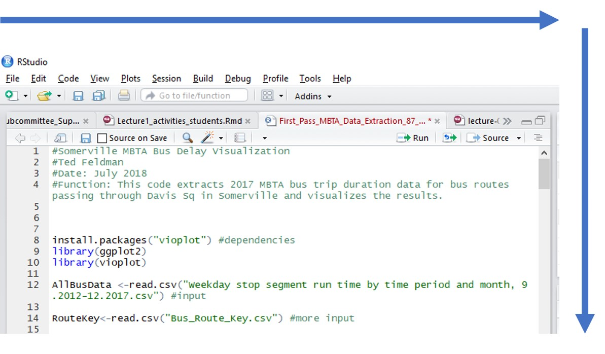
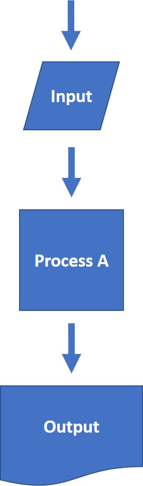
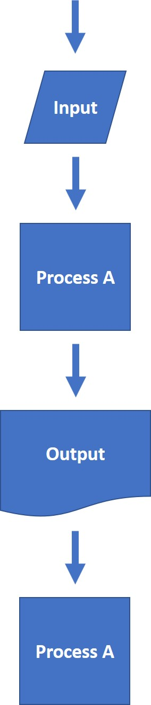
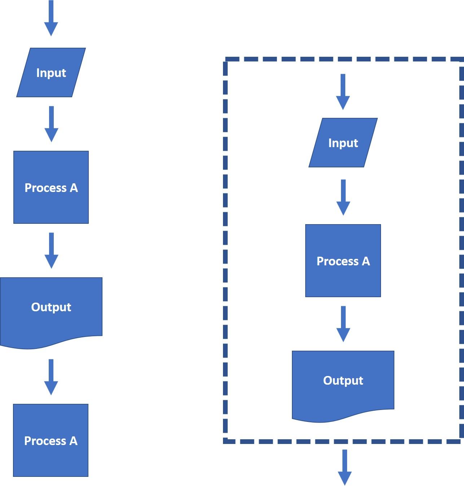

```{r setup, include=FALSE}
knitr::opts_chunk$set(echo = TRUE, cache = T)
install.packages('devtools', repos = "http://cran.us.r-project.org")
library(ggplot2)
library(tidyverse)
library(gridExtra)
library(lubridate)
library(reshape2)
library(devtools)
install_github("hadley/neiss")
library(neiss)
```

## Learning Objectives

Through these exercises you will:

  1. write your first lines of code in R
  1. be able to define program flow
  1. be able to understand the direction in which R interprets code 
  1. be able to identify the advantages of writing code in functions
  1. be able to identify the steps involved in writing a function

## Introduction to R 

Throughout the course we will use the R programming language with RStudio as a graphical user interface.  

### Some Advantages of Working with RStudio

While RStudio is not necessary to use R, working with it has some distinct advantages.

  1. A single tool that covers the full development workflow
    - No need for separate R UI, external editor, Git client, etc.
  1. Built-in viewers for many data types
  1. Projects to organize code and data
  1. Support for creating R packages
  1. Support for creating Shiny apps 

### Check your R version

Run the code chunk below to check your current version of R studio by pressing the green right-pointing arrow in R-Studio.

```{r, echo=TRUE}
R.version
```

## Hello World!

Hello world is the traditional first program everyone writes in a programming language.  Here we will save, "Hello world!" to a variable, *a*.  

**Variables** store information to be used/referenced in code that can be readily updated or changed.

Run the chunk below to run the program.

```{r, echo = TRUE}
a <- "Hello World!"
a
```

What happened?

  - We created and instantiated a variable via assignment.
  - We inspected the value of a variable.

## Let's create more variables!

We can create many more variables and use them to store an array of different types of values, including logicals, integers or numeric values, characters


```{r, echo=TRUE}
b <- TRUE
x <- 5
v <- c("one","two","three","four","five")
my_name <- "Ted"
```

## Let's inspect their values

The handy trick of using variables is that if we don't assign new values, whatever name or letter to the left of the _<-_ stores and labels its previous value.  We can then just write these labels to recall the values.  Let's give it a shot. 

```{r, echo=TRUE}
b
x
v
my_name
```

  - In computer science terminology, all of these variables are of different types or **classes**!
  
## Classes of variables

We can use the class function in R to explore what these are.  Run the code below.

```{r,echo=TRUE}
class(b)
class(x)
class(v)
class(my_name)
```

## Classes can be changed

```{r,echo=TRUE}
b
as.character(b)
as.numeric(b)
```

  - See Chapter 3 in LR2015 for details.
  
## Vectors as one-dimensional arrays of values

  - `v` above is a vector
  - it has a length
  
```{r,echo=TRUE}
v
length(v)
```
  
## Accessing `vector` elements

  - we can access individual values or a sequence of values inside `v` using the `[]` operator
  
```{r,echo=TRUE}
v[2]
v[3:4]
```


## The `factor` class

  - Factors are categorical variables. They can be ordered or unordered.

```{r,echo=TRUE}
f1 <- factor( c("Python", "R", "C++") )
f2 <- factor( c("tiny", "small", "medium", "large", "huge") )
f1
f2
```

## Where to Get Help?

There are built-in help tools in R as well as a plethora of online resources.

### R Help

```{r,echo=TRUE}
?help
# look up command: > ?<command> 
?plot
  
# search help pages: ??<keyword> 
??plotting
```

### Books

  - __Learning R__
    - Richard Cotton, O'Reilly (2015)
    - [Available on Safari Books with Harvard Key](http://proquest.safaribooksonline.com.ezp-prod1.hul.harvard.edu/book/programming/r/9781449357160)
    - referred to as _LR15_ ("for details see Chapter 3 of _LR15_")
    
  - __R for Data Science__ (Introduction to the Tidyverse)
    - Hadley Wickham & Garrett Grolemund (2017)
    - [Available on Safari Books with Harvard Key](http://proquest.safaribooksonline.com.ezp-prod1.hul.harvard.edu/book/programming/r/9781491910382)
    - referred to as _RDS17_

### Stack Overflow

  - <https://stackoverflow.com/questions/tagged/r>

### Important considerations

  - Don't copy solutions!
  - Make sure the answers that you are looking at are recent

### Blogs and Websites

  - <https://www.r-bloggers.com/> (syndicated R blogs)
  - <http://hadley.nz/> (Hadley Wickham is Chief Scientist at RStudio)

### Cheatsheets

- <https://www.rstudio.com/resources/cheatsheets/>


## Overview of Program Flow  

**Program Flow** or **Program Control Flow** is a swanky term for the order by which a set of instructions (i.e. code) gets interpreted in a computer program and by which they are executed.   

This flow is determined at run time (e.g. opening a program or pressing ``Run`` in R Studio) by the input data and by any **Control Structures**, for example, loops and conditionals, which we will talk about in lecture. 

Absent any of these **control structures** R/R Studio *will interpret and read your code left to right and top to bottom* just like you read an English language book or recipe list (see figure below).  Loops and conditionals allow us to alter this direction just like you would reading a "Choose Your Own Adventure" novel.  

```{r echo=FALSE, out.width='75%'}
library(knitr)

```


## Good practices of coding style and layout

To function correctly, it is necessary that your code executes instructions as you the program expects.  However, it is also essentially, particularly to ensure reproducibility and distributability, that your code be human readible.  To that end, here are some basic tips to increase readability and documentation of your code:

  - Start code with heading comments that identify you, the date, the code and and the function of the code
  - List dependencies first 
  - Define Variables/input 
  - Proceed to code.

## Program flow can be visualized with flow charts

Flow charts, like the one below, provide a schematic representation of the components of a program.  They are a helpful tool in outlining and designing code, particularly when programs grow more complex.  The geometry used below is a standard convention for differentiating the different components of a program.  In practice, however, this convention is fairly flexible so long as the sequence and sections are clearly identified.  Later on, we will discuss flowcharting and more formal representations in detail.
  
```{r echo=FALSE, out.width='10%'}
library(knitr)

```

## Functions

Now, what if we wanted to repeated use or *call* a program or segment of code?  Well, we could copy and paste.  However, it is undesirable to iteratively paste lines of code because *repeating lines of code can easily lead to issues with reproducibility on account of variable assignment and other types of copy/paste errors*.  

Instead, *functions* provide a means of modularizing a named sequence code or, routine (as pictured below), so that they can iteratively be used with different inputs and variable assignments without the need for extensive copying/pasting.  *Functions* typically have an output or *return a value*.   

```{r echo=FALSE, out.width='10%'}
library(knitr)

```

```{r echo=FALSE, out.width='50%'}
library(knitr)

```

## Steps to defining/creating new functions 

Here are the basic steps in writing a function:

  1. Ensure the code you might otherwise repeat works properly
  2. Name the function (preferably with a descriptive name)
  3. Define the inputs or arguements of the function inside $\texttt{function}$(place input here, sep w/comma to list multiple inputs)
  4. Place code in the body of the function between {}s
  5. Include a return statement (optional, but good practice)
  6. Call the function/test it out
  
##Function Example

Now that we know the steps entailed, let's take a look an an actually example function that will calculate one standard deviation below the mean for any numerical input.  Try it out!  

**Expected outputs:**

1. 3
1. 30
```{r echo=TRUE}
OneSDbelowMean<-function(x){      #define the function with x as input.  Inputs get put between ()s after function. 
  sdbelow<- mean(x)-sd(x)         #body of function
  return(sdbelow)                 #return statement
}
test<-c(3,4,5)                    #test variable - an example where it's easy to calculate the correct result.
OneSDbelowMean(test)                 #function call with test
OneSDbelowMean(test<-c(30,40,50))    #function call with explicit assignment of arguement
```  

## Additional References
  More resources for programining style include: 
  
- Hadley Wickham's tidyverse style guide: (http://style.tidyverse.org/)

## Questions

1. Please identify the highlighted segments of the code snippet shown below (p.s. in case you are wondering about the robot picture: https://en.wikipedia.org/wiki/Short_Circuit_(1986_film)).

1. *Functions- Your Turn*

Let's revisit the function, *OneSDbelowMean* we discussed previously that calculates one standard deviation below the mean for a given numerical input.  Run *OneSDbelowMean* using the code below.  But, this time, **complete the function call using *x* instead of test** as the input to the function. 

X contains the ages of all patients represented in a curated version of the NEISS dataset.  

What value is returned by the function when you run the code?

```{r eval=FALSE, echo=TRUE}
library(neiss)                    #locad the curated data package
data(injuries)                    #load the dataset
names(injuries)
x <-injuries$age                  #define the variable
OneSDbelowMean<-function(x){      #define the function with x as input.  Inputs get put between ()s after function. 
  sdbelow<- mean(x)-sd(x)         #body of function
  return(sdbelow)                 #return statement
}
OneSDbelowMean(x)                 #Line you need to modify - function call 
```